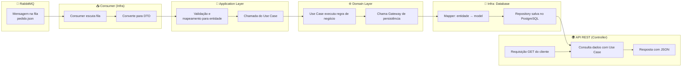

# Desafio Engenheiro de Software - BTG Pactual

Este repositório contém a solução para o desafio técnico proposto pelo BTG Pactual, utilizando Java e Clean Architecture, com integração de RabbitMQ, PostgreSQL e Docker para uma aplicação de pedidos.

---

## 📌 Objetivo

Criar uma aplicação capaz de:
- Processar pedidos enviados por uma fila RabbitMQ.
- Persistir os dados em banco relacional.
- Expor uma API REST com:
  - Valor total do pedido
  - Quantidade de pedidos por cliente
  - Lista de pedidos por cliente

---

## 📁 Estrutura do Projeto (Clean Architecture)

```bash
btg-software-engineer-challenge/
├── docs/                         # Documentação, plano de trabalho, evidências
├── src/main/java/com/btg/orders/
│   ├── app/                      # Camada de aplicação (REST Controllers, DTOs)
│   │   ├── controllers/
│   │   ├── dto/
│   │   └── mappers/
│   ├── domain/                   # Camada de domínio (Entidades, Use Cases, Interfaces)
│   │   ├── entities/
│   │   ├── usecases/
│   │   └── gateways/
│   └── infrastructure/           # Integração com banco, fila, frameworks
│       ├── database/
│       │   ├── models/
│       │   ├── repositories/
│       │   ├── mappers/
│       │   └── gateways/
│       └── messaging/
│           ├── config/
│           ├── consumer/
│           ├── dto/
│           └── gateways/
├── src/test/java/                # Testes unitários e de integração
├── scripts/                      # Scripts para testes e utilidades
├── docker-compose.yml
├── Dockerfile
└── README.md
```

---

## 🧠 Fluxo da Solução



---

## 🧪 Funcionalidades

### 🔄 Consumo de mensagens JSON via RabbitMQ
- Consumer automático que processa mensagens da fila `order.queue`
- Tratamento de erros com notificações
- Retry automático em caso de falhas

### 💾 Persistência em PostgreSQL
- Modelo relacional otimizado
- Transações ACID
- Índices para performance

### 🌐 API REST para consultas:
- `GET /api/orders/{orderCode}/total` - Valor total do pedido
- `GET /api/orders/clients/{clientId}/count` - Quantidade de pedidos por cliente
- `GET /api/orders/clients/{clientId}` - Lista de pedidos por cliente

---

## 🧰 Tecnologias Utilizadas

| Tecnologia | Versão | Propósito |
|-----------|---------|-----------|
| Java | 17 | Linguagem principal |
| Spring Boot | 3.2.0 | Framework web |
| RabbitMQ | Latest | Mensageria |
| PostgreSQL | 15 | Banco de dados |
| Docker / Compose | Latest | Containerização |
| JUnit / Mockito | 5.x | Testes |
| Lombok | Latest | Redução de boilerplate |
| MapStruct | 1.5.5 | Mapeamento automático |
| OpenAPI/Swagger | 2.x | Documentação da API |

---

## 🐳 Executando com Docker

### Pré-requisitos
- Docker e Docker Compose instalados
- Python 3.x (para scripts de teste)
- Porta 8080, 5432 e 5672 disponíveis

### Subir ambiente completo
```bash
# Subir todos os serviços
docker-compose up --build

# Subir em background
docker-compose up -d --build
```

### Verificar status dos serviços
```bash
# Ver logs
docker-compose logs -f

# Status dos containers
docker-compose ps
```

### Parar ambiente
```bash
docker-compose down
```

---

## 🚀 Executando Localmente (Desenvolvimento)

### 1. Subir apenas as dependências
```bash
# Subir apenas PostgreSQL e RabbitMQ
docker-compose up postgres rabbitmq -d
```

### 2. Executar aplicação
```bash
# Compilar e executar
mvn spring-boot:run

# Ou via IDE (IntelliJ/VSCode)
```

---

## 🔧 MapStruct - Mapeamento Automático

O projeto utiliza **MapStruct** para mapeamento automático entre objetos, eliminando código boilerplate:

```java
@Mapper(componentModel = "spring")
public interface OrderMapper {
    Order toDomain(OrderModel model);
    OrderModel toModel(Order domain);
}
```

**Vantagens:**
- ✅ Código gerado em tempo de compilação (alta performance)
- ✅ Type-safety garantido
- ✅ Integração automática com Spring
- ✅ Menos código manual para manter

📖 **[Ver exemplos completos de migração](docs/mapstruct-examples.md)**
📖 **[Ver otimizações com Lombok](docs/lombok-optimizations.md)**
📖 **[Ver melhorias com Interfaces](docs/interfaces-implementation.md)**
📖 **[Ver limpeza de anotações](docs/annotation-cleanup.md)**

---

## 🧪 Testando a Aplicação

### 1. Enviar pedidos via RabbitMQ
```bash
# Instalar dependência Python
pip install pika

# Enviar pedido único
python scripts/send-test-order.py

# Enviar múltiplos pedidos
python scripts/send-test-order.py multiple
```

### 2. Testar APIs via Swagger
- Acesse: http://localhost:8080/swagger-ui.html
- Teste os endpoints disponíveis

### 3. Exemplo de mensagem JSON
```json
{
  "codigoPedido": 1001,
  "codigoCliente": 1,
  "itens": [
    {
      "produto": "lápis",
      "quantidade": 100,
      "preco": 1.10
    },
    {
      "produto": "caderno",
      "quantidade": 10,
      "preco": 1.00
    }
  ]
}
```

### 4. Testar APIs via curl
```bash
# Obter total do pedido
curl http://localhost:8080/api/orders/1001/total

# Contar pedidos por cliente
curl http://localhost:8080/api/orders/clients/1/count

# Listar pedidos por cliente
curl http://localhost:8080/api/orders/clients/1
```

---

## 🔧 Monitoramento e Observabilidade

### URLs importantes:
- **Aplicação**: http://localhost:8080
- **Swagger UI**: http://localhost:8080/swagger-ui.html
- **RabbitMQ Management**: http://localhost:15672 (guest/guest)
- **Health Check**: http://localhost:8080/actuator/health

### Logs da aplicação:
```bash
# Ver logs em tempo real
docker-compose logs -f app

# Logs específicos
docker logs orders-app
```

---

## 🏗️ Executando Testes

### Testes unitários
```bash
# Todos os testes
mvn test

# Testes específicos
mvn test -Dtest=OrderTest
mvn test -Dtest=ProcessOrderUseCaseTest
```

### Testes de integração
```bash
# Com TestContainers
mvn verify
```

---

## 📋 Evidências de Funcionamento

### 1. Processamento de Pedidos
- Logs mostram mensagens sendo consumidas
- Dados persistidos no PostgreSQL
- Notificações enviadas via RabbitMQ

### 2. APIs Funcionais
- Swagger UI acessível
- Endpoints respondem corretamente
- Dados consistentes

### 3. Observabilidade
- Health checks ativos
- Métricas disponíveis
- Logs estruturados

---

## 📝 Notas Importantes

1. **Clean Architecture**: Separação clara de responsabilidades
2. **Inversão de Dependência**: Interfaces definem contratos
3. **Testabilidade**: Mocks e testes unitários abrangentes
4. **Observabilidade**: Logs estruturados e health checks
5. **Containerização**: Aplicação pronta para produção

---

## 🔍 Troubleshooting

### Problemas comuns:
1. **Porta já em uso**: Verificar se as portas 8080, 5432, 5672 estão livres
2. **Falha na conexão**: Aguardar health checks dos serviços
3. **Mensagens não processadas**: Verificar logs do RabbitMQ

### Comandos úteis:
```bash
# Limpar volumes
docker-compose down -v

# Reconstruir imagens
docker-compose build --no-cache

# Reiniciar serviços
docker-compose restart
```
