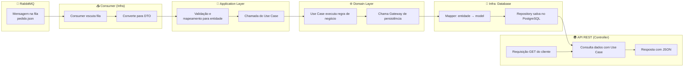

# Desafio Engenheiro de Software - BTG Pactual

Este repositório contém a solução para o desafio técnico proposto pelo BTG Pactual, utilizando Java e Clean Architecture, com integração de RabbitMQ, PostgreSQL e Docker para uma aplicação de pedidos.

---

## 📌 Objetivo

Criar uma aplicação capaz de:
- Processar pedidos enviados por uma fila RabbitMQ.
- Persistir os dados em banco relacional.
- Expor uma API REST com:
  - Valor total do pedido
  - Quantidade de pedidos por cliente
  - Lista de pedidos por cliente

---

## 📁 Estrutura do Projeto (Clean Architecture)

```bash
btg-software-engineer-challenge/
├── docs/                         # Documentação, plano de trabalho, evidências
├── app/                          # Camada de aplicação (REST Controllers, DTOs)
│   └── controller/
│   └── dto/
├── domain/                       # Camada de domínio (Entidades, Use Cases, Interfaces)
│   └── entities/
│   └── usecases/
│   └── gateways/
├── infrastructure/              # Integração com banco, fila, frameworks
│   └── database/
│       └── repository/
│       └── model/
│   └── mq/
│       └── consumer/
│       └── config/
├── config/                       # Configurações da aplicação (YAML, Docker, etc.)
├── test/                         # Testes unitários e de integração
├── docker-compose.yml
├── Dockerfile
├── README.md
```

🧠 Fluxo da Solução



🧪 Funcionalidades
🔄 Consumo de mensagens JSON via RabbitMQ

💾 Persistência em PostgreSQL

🌐 API REST para consultas:

GET /orders/{orderId}/total

GET /clients/{clientId}/orders/count

GET /clients/{clientId}/orders

🧰 Tecnologias Utilizadas
Tecnologia	Versão
Java	17
Spring Boot	3.x
RabbitMQ	Latest
PostgreSQL	15
Docker / Compose	Latest
JUnit / Mockito	Testes
Lombok	Suporte

🐳 Executando com Docker
bash
Copiar
Editar
# Subir ambiente completo
docker-compose up --build
A aplicação estará acessível em: http://localhost:8080

RabbitMQ UI: http://localhost:15672
Usuário: guest | Senha: guest


Perguntar ao ChatGPT
