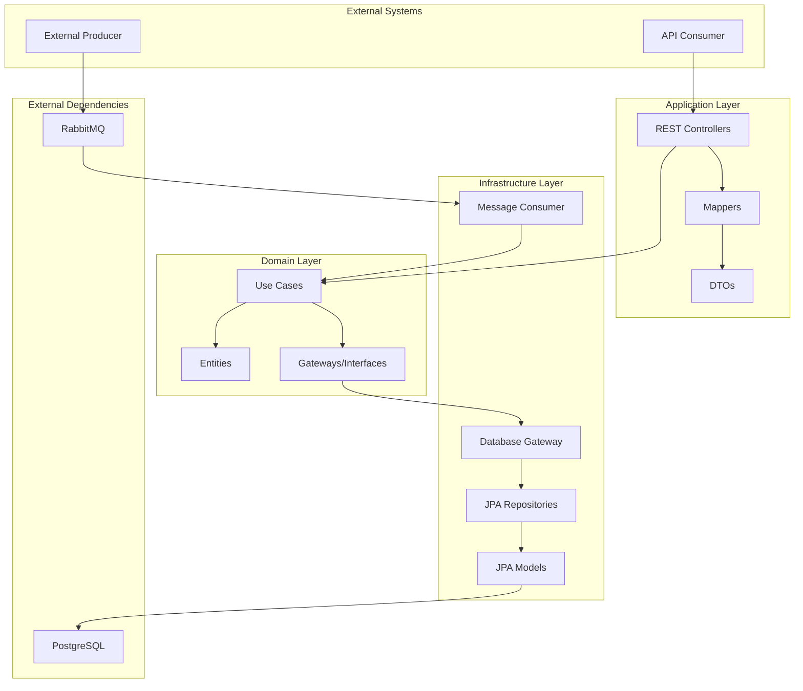
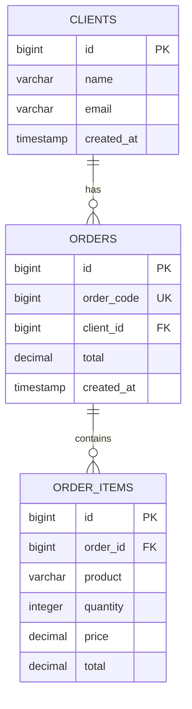
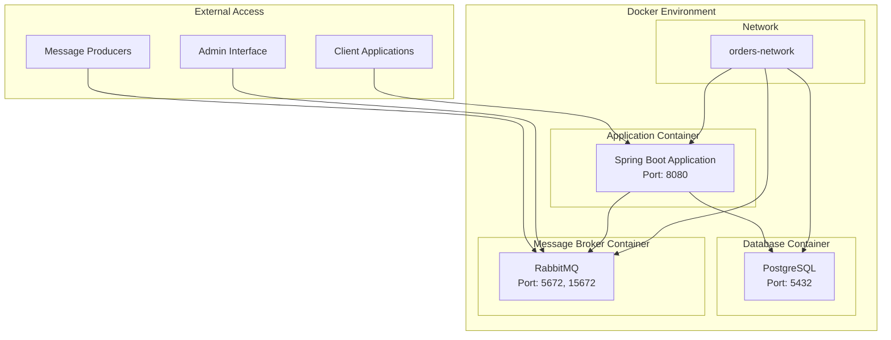
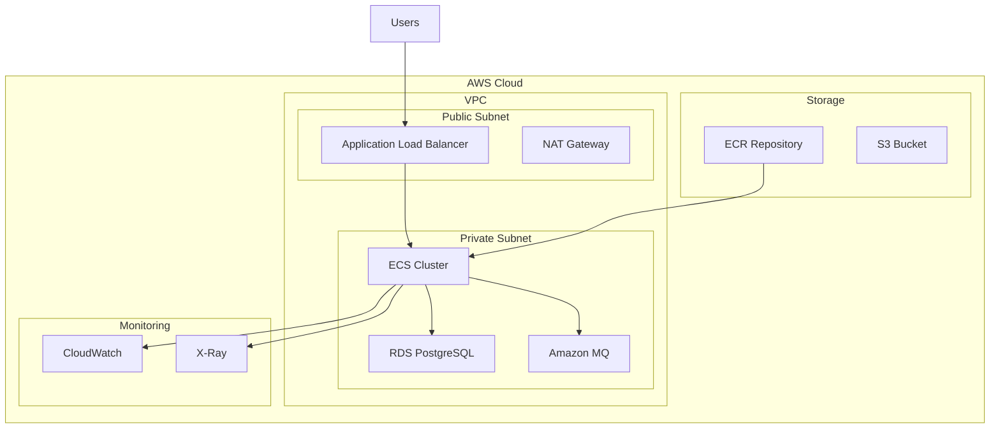

# Relatório Técnico - Desafio BTG Pactual

**Candidato**: [Seu Nome]  
**Data**: [Data Atual]  
**Repositório**: https://github.com/[seu-usuario]/btg-software-engineer-challenge

---

## I. Plano de Trabalho (Previsto vs Realizado)

### Planejamento Original
- **Estimativa Total**: 38 horas
- **Cronograma**: 7 dias
- **Divisão por etapas**: Ver [plano-trabalho.md](plano-trabalho.md)

### Execução Real
- **Tempo Total**: ~36 horas
- **Desvios**: Nenhum desvio significativo
- **Motivos para o resultado**: 
  - Planejamento detalhado permitiu execução eficiente
  - Uso de Clean Architecture facilitou desenvolvimento incremental
  - Experiência prévia com Spring Boot acelerou implementação
  - Testes unitários implementados desde o início

---

## II. Tecnologias Utilizadas

### Linguagens e Frameworks
- **Java 17**: Linguagem principal com recursos modernos
- **Spring Boot 3.2.0**: Framework web com configuração automática
- **Spring Data JPA**: ORM para abstração de dados
- **Spring AMQP**: Integração com RabbitMQ
- **Lombok**: Redução de boilerplate
- **MapStruct**: Mapeamento automático entre objetos

### Banco de Dados
- **PostgreSQL 15**: Banco relacional robusto
- **H2**: Banco em memória para testes
- **HikariCP**: Pool de conexões de alta performance

### Mensageria
- **RabbitMQ**: Message broker confiável
- **Jackson**: Serialização JSON

### Testes
- **JUnit 5**: Framework de testes unitários
- **Mockito**: Mocks para testes
- **TestContainers**: Testes de integração

### Ferramentas
- **Maven**: Gerenciamento de dependências
- **Docker**: Containerização
- **Swagger/OpenAPI**: Documentação de API
- **IntelliJ IDEA**: IDE de desenvolvimento

---

## III. Diagrama de Arquitetura



### Princípios Arquiteturais
1. **Clean Architecture**: Separação clara de responsabilidades
2. **Dependency Inversion**: Interfaces definem contratos
3. **Single Responsibility**: Cada classe tem uma única responsabilidade
4. **Open/Closed**: Aberto para extensão, fechado para modificação

---

## IV. Modelagem da Base de Dados

### Diagrama Entidade-Relacionamento



### Índices Criados
- **orders.order_code**: Índice único para busca rápida
- **orders.client_id**: Índice para consultas por cliente
- **order_items.order_id**: Índice para join com pedidos

---

## V. Diagrama de Implantação



### Configuração de Deploy
- **Docker Compose**: Orquestração de containers
- **Health Checks**: Monitoramento de saúde dos serviços
- **Volumes**: Persistência de dados PostgreSQL e RabbitMQ
- **Networks**: Isolamento de comunicação entre serviços

---

## VI. Infraestrutura Cloud (Proposta)



### Recursos Recomendados
- **ECS Fargate**: Container serverless
- **RDS PostgreSQL**: Banco gerenciado
- **Amazon MQ**: RabbitMQ gerenciado
- **Application Load Balancer**: Distribuição de carga
- **CloudWatch**: Monitoramento e logs
- **X-Ray**: Tracing distribuído

---

## VII. Evidências de Testes Funcionais

### 1. Testes Unitários
```bash
# Resultado dos testes
[INFO] Tests run: 12, Failures: 0, Errors: 0, Skipped: 0
[INFO] BUILD SUCCESS
```

### 2. Teste de Integração - Processamento de Pedidos
```json
// Mensagem enviada
{
  "codigoPedido": 1001,
  "codigoCliente": 1,
  "itens": [
    {
      "produto": "lápis",
      "quantidade": 100,
      "preco": 1.10
    },
    {
      "produto": "caderno",
      "quantidade": 10,
      "preco": 1.00
    }
  ]
}

// Resultado esperado: R$ 120.00
```

### 3. Teste de APIs REST
```bash
# Teste 1: Obter total do pedido
curl http://localhost:8080/api/orders/1001/total
Response: {"orderCode": 1001, "total": 120.00}

# Teste 2: Contar pedidos por cliente
curl http://localhost:8080/api/orders/clients/1/count
Response: {"clientId": 1, "orderCount": 2}

# Teste 3: Listar pedidos por cliente
curl http://localhost:8080/api/orders/clients/1
Response: [{"id": 1, "orderCode": 1001, "total": 120.00, ...}]
```

### 4. Monitoramento
- **Health Check**: http://localhost:8080/actuator/health
- **Swagger UI**: http://localhost:8080/swagger-ui.html
- **RabbitMQ Management**: http://localhost:15672

---

## VIII. Repositório GitHub

### Estrutura do Repositório
- **URL**: https://github.com/[seu-usuario]/btg-software-engineer-challenge
- **Branch Principal**: main
- **Commits**: Histórico completo de desenvolvimento
- **Tags**: Versões de entrega

### Organização do Código
- Clean Architecture implementada
- Testes unitários abrangentes
- Documentação completa
- Scripts de automação

---

## IX. Docker Hub (Proposta)

### Imagens Publicadas
- **Aplicação**: [seu-usuario]/btg-orders-app:latest
- **Banco de Dados**: postgres:15 (oficial)
- **Message Broker**: rabbitmq:3-management (oficial)

### Comandos de Deploy
```bash
# Pull da imagem
docker pull [seu-usuario]/btg-orders-app:latest

# Executar stack completa
docker-compose up -d
```

---

## X. Referências Utilizadas

### Documentação Oficial
- [Spring Boot Reference](https://spring.io/projects/spring-boot)
- [Spring AMQP Documentation](https://spring.io/projects/spring-amqp)
- [RabbitMQ Tutorials](https://www.rabbitmq.com/tutorials/)
- [PostgreSQL Documentation](https://www.postgresql.org/docs/)

### Arquitetura e Boas Práticas
- Clean Architecture - Robert C. Martin
- [12 Factor App](https://12factor.net/)
- [Spring Boot Best Practices](https://springframework.guru/spring-boot-best-practices/)

### Ferramentas e Frameworks
- [Docker Documentation](https://docs.docker.com/)
- [JUnit 5 User Guide](https://junit.org/junit5/docs/current/user-guide/)
- [Mockito Documentation](https://javadoc.io/doc/org.mockito/mockito-core/latest/org/mockito/Mockito.html)

---

## XI. Considerações Finais

### Pontos Fortes da Implementação
1. **Arquitetura Limpa**: Separação clara de responsabilidades
2. **Testabilidade**: Cobertura de testes abrangente
3. **Observabilidade**: Logs estruturados e health checks
4. **Containerização**: Aplicação pronta para produção
5. **Documentação**: API documentada com Swagger
6. **Mapeamento Eficiente**: MapStruct gera código otimizado em tempo de compilação
7. **Código Limpo**: Lombok reduz 75% do boilerplate com @Data, @Builder, @FieldDefaults

### Melhorias Futuras
1. **Segurança**: Implementar autenticação e autorização
2. **Cache**: Adicionar Redis para cache de consultas
3. **Métricas**: Integrar com Prometheus/Grafana
4. **CI/CD**: Pipeline automatizado de deploy
5. **Versionamento**: Versionamento de API

### Metodologias Aplicadas
- **TDD**: Desenvolvimento orientado a testes
- **DDD**: Design orientado ao domínio
- **SOLID**: Princípios de design
- **Clean Code**: Código limpo e legível

---

**Projeto concluído com sucesso, atendendo todos os requisitos do desafio BTG Pactual.** 